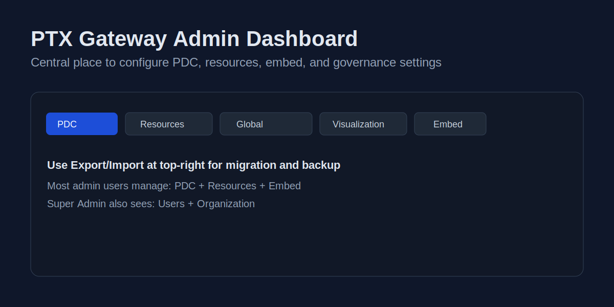
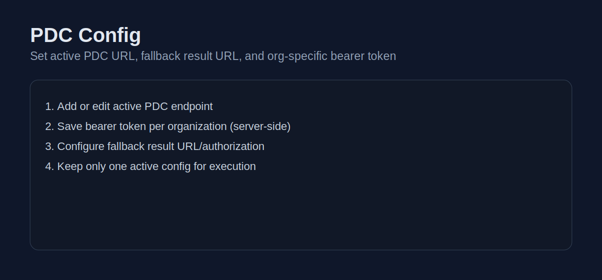
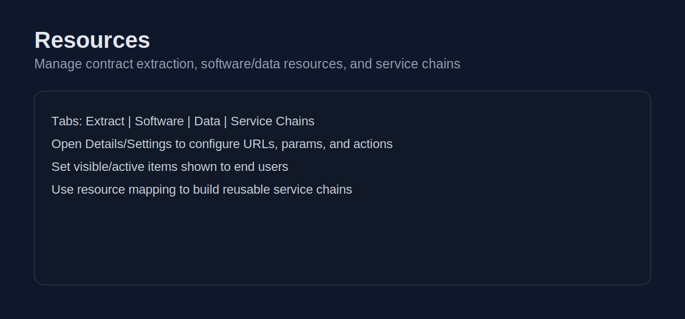
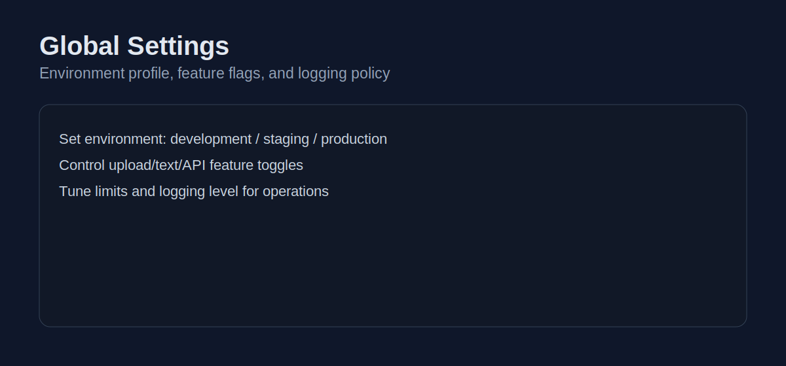
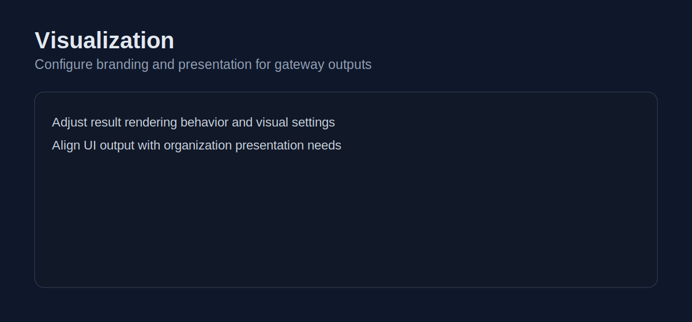
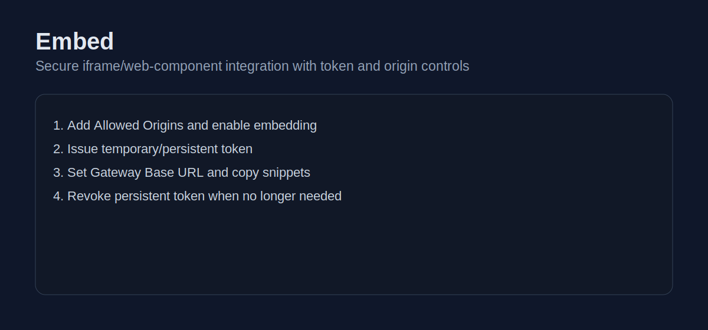
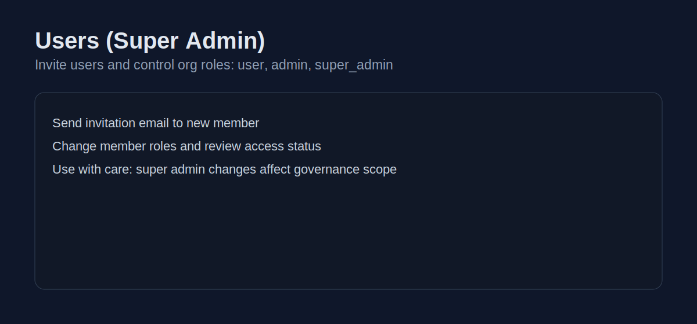
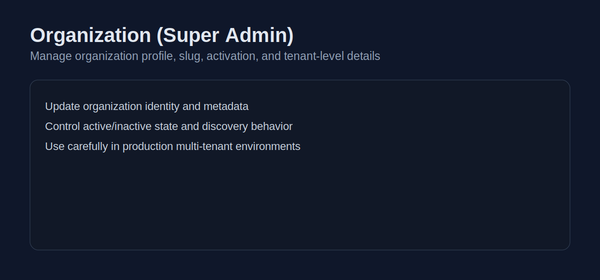

# PTX Gateway Admin Pages Guide

This guide helps administrators manage their own PTX Gateway configuration safely and consistently.

## Admin Dashboard Overview

Purpose:
- Central control panel for organization configuration.
- Export/Import settings for backup, migration, and environment setup.

Main tabs:
- `PDC Config`
- `Resources`
- `Global Settings`
- `Visualization`
- `Embed`
- `Users` (super admin only)
- `Organization` (super admin only)

## 1) PDC Config

Use this page to:
- Set active PDC endpoint URL.
- Configure fallback result URL/authorization.
- Save organization-specific bearer token for execution.

Admin checklist:
1. Set/verify active PDC URL.
2. Add bearer token (if required by your PDC endpoint).
3. Save and test with a small execution payload.

## 2) Resources

Use this page to:
- Extract contract definitions.
- Manage software/data resources.
- Configure service chains and embedded resources.

Sub-tabs:
- `Extract`: ingest PTX contract metadata into gateway config.
- `Software`: manage application-like resources.
- `Data`: manage data endpoint resources and upload/result options.
- `Service Chains`: define orchestrated execution flows.

Admin checklist:
1. Import/extract contract first.
2. Verify resource URLs, parameters, and visibility.
3. Verify service-chain resource mapping.

## 3) Global Settings

Use this page to:
- Set environment profile (`development` / `staging` / `production`).
- Configure feature toggles and limits.
- Adjust operational logging level.

Admin checklist:
1. Set correct environment mode.
2. Confirm feature toggles and limits match your policy.
3. Keep production logging at safe verbosity.

## 4) Visualization

Use this page to:
- Configure how outputs/results are presented to users.
- Align gateway experience with organization branding/UX.

Admin checklist:
1. Confirm visualization options for your target use cases.
2. Validate results rendering after each major config update.

## 5) Embed

Use this page to:
- Enable/disable embedding.
- Register allowed origins.
- Issue/revoke temporary or persistent embed tokens.
- Copy iframe/web-component snippets.

Admin checklist:
1. Add external host to `Allowed Origins`.
2. Set the correct `Gateway Base URL` (reachable from external host).
3. Issue token and copy snippet.
4. Revoke persistent token when no longer needed.

## 6) Users (Super Admin Only)

Use this page to:
- Invite users by email.
- Assign roles (`user`, `admin`, `super_admin`).
- Manage organization member access.

Admin checklist:
1. Invite only required members.
2. Apply least-privilege role assignment.
3. Review role changes regularly.

## 7) Organization (Super Admin Only)

Use this page to:
- Manage organization-level identity and settings.
- Update organization metadata and state.

Admin checklist:
1. Verify slug/identity fields before saving.
2. Confirm activation/discovery settings in production.
3. Coordinate tenant-level changes with governance owner.

## Recommended Admin Workflow
1. Configure `PDC Config`.
2. Set up `Resources` and `Service Chains`.
3. Adjust `Global Settings` and `Visualization`.
4. Configure `Embed` if external integration is needed.
5. Export settings backup after major updates.
